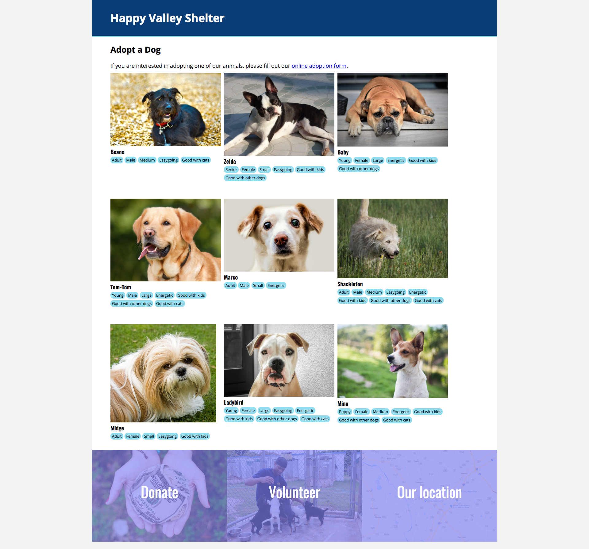

# Build a Dog Adoption Site

## Directions

Your task is to build one page for an animal shelter. You will need to build the HTML and CSS to make this page. The page should look like the following:



The fonts used are Open Sans and Oswald, and can be included by adding the following line to your document's `<head>` before your own CSS:

```html
<link
  href="https://fonts.googleapis.com/css?family=Open+Sans:400,700|Oswald:400,700"
  rel="stylesheet"
/>
```

The link to the adoption application form should go to `#`, which is a way to link to the same page as you are currently on.

## Page sections

This page can be broken into three major sections: the header, the main part with the dogs, and the footer. Each increases in difficulty, and you should attempt them in that order. Like all projects, the goal is learning, not perfect completion.

### Section 1: the header

This section has a background color, some padding, and a border on the bottom. Start by getting the text to show, then change the background and text colors. After that, you can add the padding and bottom border.

The background color is #004175 and the border color is #89DEEF.

### Section 2: the dogs

The first thing you want to do is to get the dogs' names, images, and traits to show. Think about what HTML elements make the most sense here. Don't let the default styling overly influence your decision. For example, the traits are a list of items -- what HTML element represents a list of items?

Once you have these showing, work on the fonts and colors. The color behind each trait is #89DEEF.

Get the traits to show up next to each other. They still need some padding and margin. There are two good ways to get them to look like they should: [flexbox](https://www.freecodecamp.org/news/an-animated-guide-to-flexbox-d280cf6afc35/) and [`display: inline-block`](https://medium.com/better-programming/understanding-css-display-none-block-inline-and-inline-block-63f6510df93). If you use Flexbox, you'll need to [know how to wrap the elements](https://developer.mozilla.org/en-US/docs/Web/CSS/CSS_Flexible_Box_Layout/Basic_Concepts_of_Flexbox#Multi-line_flex_containers_with_flex-wrap)

Finally, once you have each dog showing up with its image and traits, but each one on top of the next, use flexbox or inline-block to lay them out on the page next to each other. **Important**: they don't have to be three-in-a-row. They could be 1, 2, 3, 4, or more depending on the size of the browser. The web is made for fluid documents.

### Section 3: the footer

This is the most difficult section, and some professional web developers would struggle with it. Once you have the three words on the page, try laying them out in three blocks next to each other. (These should always be in three blocks.) Flexbox may be your friend here. If you are using flexbox, the property `flex: 1 1 auto` should be applied to each block to get them to grow to fill the page.

Once they are next to each other, give them some height and center the text horizontally in them. This should be fairly straightforward.

The first major challenge is next: how to center them vertically? There's multiple ways to do this, including nesting flexbox containers. A simple way involves setting `line-height` equal to the height of the containing element.

Next, add a background color (#A6A9F0). If you can do this, you're almost done!

The last and hardest challenge is getting the images to appear with the bluish filter on them. The `background` property will make this work, and you [can read how to add a color overly to an image at CSS-Tricks](https://css-tricks.com/tinted-images-multiple-backgrounds/).
